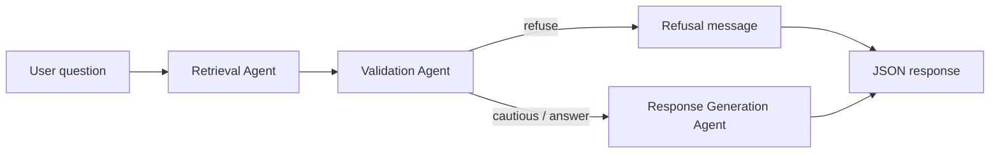

# Architecture (quick reference)

Full documentation: **[GUIDE.md](GUIDE.md)**.

## Agent workflow



| Agent | File | Role |
|-------|------|------|
| Retrieval | `backend/app/agents/retrieval.py` | pgvector cosine search |
| Validation | `backend/app/agents/validation.py` | Confidence + routing |
| Response | `backend/app/agents/response.py` | Grounded LLM + citations |

## Repo map

```
backend/app/
  api/routes/     # HTTP endpoints
  agents/         # LangGraph workflow
  ingestion/      # SEC + PDF pipelines
  rag/            # embeddings + retriever
  db/             # SQLAlchemy models
frontend/src/     # React UI
database/init/    # SQL schema
```

## Confidence routing

- `confidence = 0.6 × top_score + 0.4 × avg_score`
- `refuse` if below `CONFIDENCE_REFUSE_THRESHOLD` (default 0.35)
- `cautious` between refuse and `CONFIDENCE_CAUTIOUS_THRESHOLD` (default 0.55)
- `answer` above cautious threshold

See GUIDE §2 and §8 for data flow and API details.
