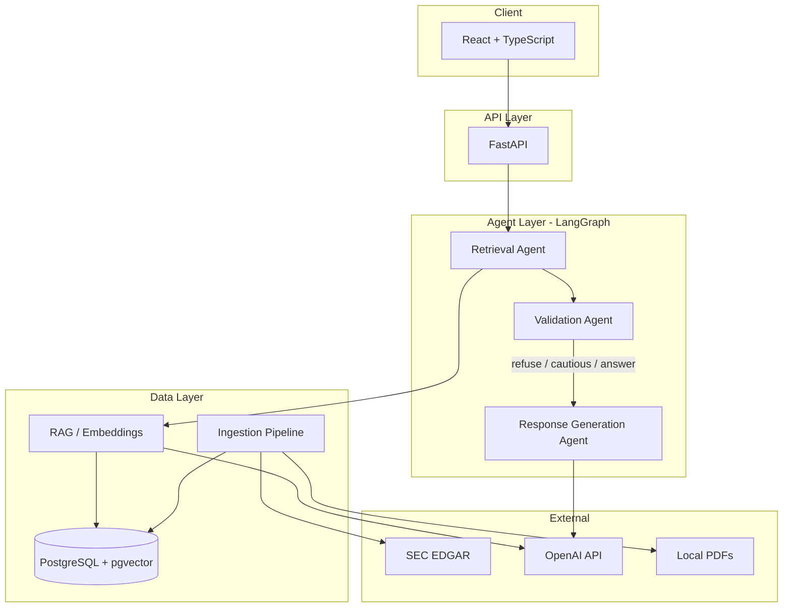
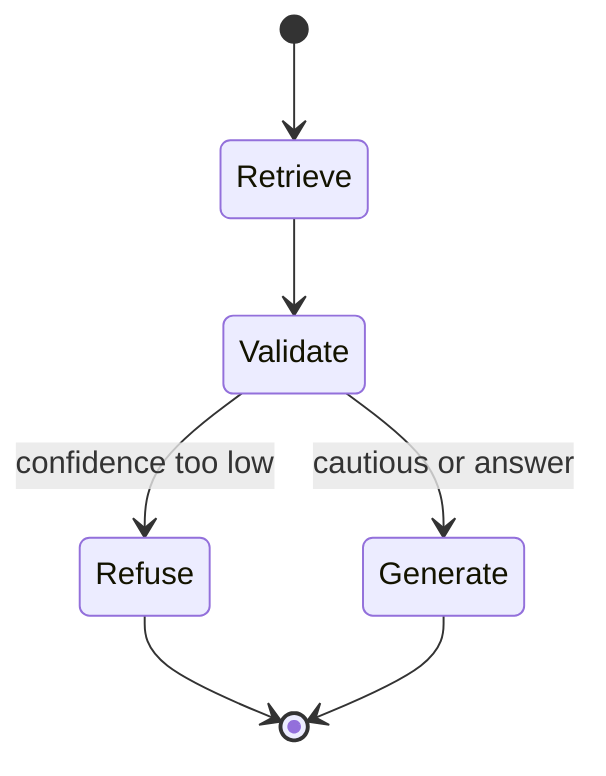
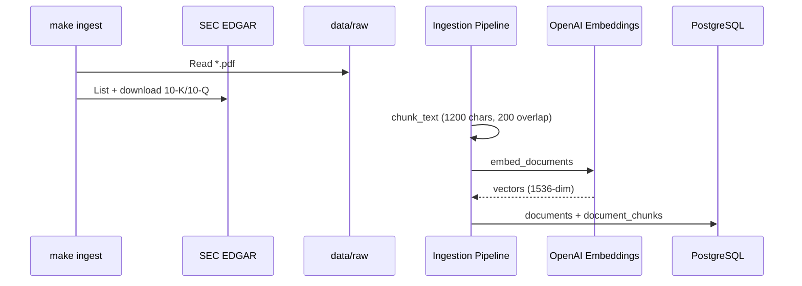
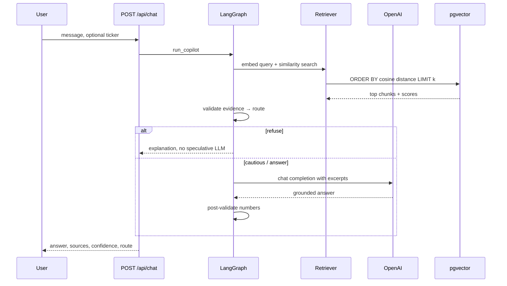
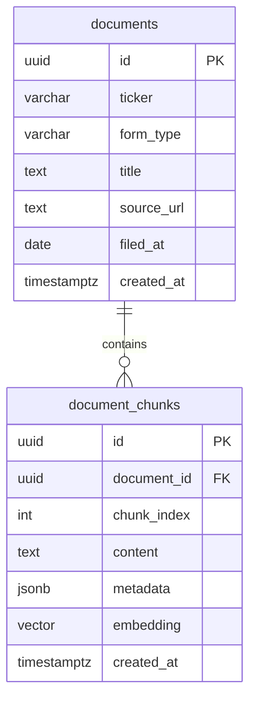

# Wealth Intelligence Copilot — Project Guide

Complete documentation for architecture, operations, and interview preparation.

---

## 1. Architecture explanation

### System overview

The copilot is a **retrieval-augmented generation (RAG)** system with a **multi-step agent workflow** on top. Users ask questions in a React UI; a FastAPI backend retrieves evidence from PostgreSQL/pgvector, validates whether there is enough support, and only then generates a grounded answer.



### Layer responsibilities

| Layer | Location | Responsibility |
|-------|----------|----------------|
| **Frontend** | `frontend/` | Chat UI, citations, confidence badge |
| **API** | `backend/app/api/` | HTTP contracts, error mapping, CORS |
| **Agents** | `backend/app/agents/` | LangGraph orchestration, validation routing |
| **RAG** | `backend/app/rag/` | Embeddings, vector search |
| **Ingestion** | `backend/app/ingestion/` | SEC + PDF fetch, chunk, store |
| **Database** | `database/init/` | Schema, pgvector extension |

### Agent workflow (implemented)



| Agent | Module | Purpose |
|-------|--------|---------|
| **Retrieval** | `agents/retrieval.py` | Cosine similarity over chunk embeddings; optional ticker filter |
| **Validation** | `agents/validation.py` | Evidence score, confidence, route (`refuse` / `cautious` / `answer`) |
| **Response generation** | `agents/response.py` | LLM answer with `[1][2]` citations; numeric post-validation |

**Planned extensions:** Summarization Agent (compress long filings), Compliance/Risk Agent (risk-factor focus). Validation + routing is the current anti-hallucination core.

---

## 2. Data flow explanation

### Ingestion flow (offline)



**Steps:**

1. **Source** — SEC filings via `sec_filings.py` (CIK lookup, submissions API, primary document download) or PDFs via `pdf_loader.py`.
2. **Parse** — Plain text extraction (HTML filings stored as text; PDF via PyPDF).
3. **Chunk** — Character-based chunks with overlap (simple, predictable; swappable for semantic chunkers).
4. **Embed** — `text-embedding-3-small` → 1536-dimensional vectors.
5. **Store** — One `documents` row per filing/PDF; many `document_chunks` rows with `embedding` column.

### Query flow (online)



**Confidence formula:**

```
confidence = 0.6 × max(chunk_scores) + 0.4 × avg(chunk_scores)
```

Optional penalty if generated numbers are not found in source excerpts. Compared against `CONFIDENCE_REFUSE_THRESHOLD` and `CONFIDENCE_CAUTIOUS_THRESHOLD` in `.env`.

---

## 3. Design decisions

| Decision | Choice | Rationale |
|----------|--------|-----------|
| **Vector DB** | PostgreSQL + pgvector | One database for metadata + vectors; familiar ops; good for portfolio scale |
| **Orchestration** | LangGraph | Explicit multi-step flow, conditional routing, easy to extend with more agents |
| **Chunking** | Fixed-size character chunks | Simple to debug; good enough for demo; avoids extra dependencies |
| **Embeddings** | OpenAI `text-embedding-3-small` | Strong quality/cost balance; 1536 dims match schema |
| **LLM** | `gpt-4o-mini` | Fast, cheap, sufficient for citation-style Q&A |
| **Validation** | Rule-based routing first | No extra LLM call per request; predictable; works when API quota is limited |
| **Refusal path** | Skip generation when evidence weak | Reduces hallucinations more than prompt-only guardrails |
| **Monorepo layout** | `backend/` + `frontend/` + `database/` | Clear boundaries for interviews and team scaling |
| **Config** | Root `.env` via absolute path | Avoids cwd bugs when uvicorn starts from `backend/` |

---

## 4. Tradeoffs

| Area | What we optimized for | What we gave up |
|------|----------------------|-----------------|
| **Chunking** | Simplicity, speed to ship | Semantic boundaries, section-aware splits (Item 1A risk factors) |
| **Retrieval** | Pure vector search | Hybrid BM25 + rerankers (often +20% relevance in production) |
| **Validation** | Zero extra LLM cost | LLM-as-judge for claim-level entailment |
| **SEC parsing** | Raw text download | Clean HTML→MD, table extraction |
| **Agents** | 3 focused agents | Full 5-agent suite (summarization, compliance) — documented as roadmap |
| **Auth** | Local dev simplicity | No user accounts or API keys on endpoints |
| **Sync ingest** | CLI `make ingest` | Background workers, queues, incremental updates |

These tradeoffs are intentional for a **portfolio MVP** that still demonstrates production thinking.

---

## 5. Scalability considerations

### Current scale (portfolio / demo)

- Single FastAPI process, single Postgres instance, synchronous ingest CLI.
- Suitable for thousands of chunks and low concurrent users.

### Horizontal scaling path

| Component | Scale approach |
|-----------|----------------|
| **API** | Multiple Uvicorn/Gunicorn workers behind a load balancer; stateless — session data in DB only |
| **Ingestion** | Celery/RQ workers, S3 for raw filings, idempotent chunk IDs |
| **Postgres** | Read replicas for search; connection pooling (PgBouncer) |
| **Vectors** | IVFFlat/HNSW index on `embedding`; partition by `ticker` or date; migrate to dedicated vector DB (Pinecone, Qdrant) at very large scale |
| **Embeddings** | Batch API, cache by content hash, open-source models on GPU for cost control |

### Bottlenecks to watch

1. **Embedding API rate limits** during bulk ingest.
2. **Sequential SEC downloads** — parallelize per ticker with respectful rate limits.
3. **Full table scan** without ANN index — enable IVFFlat after ~10k+ vectors.
4. **Large 10-K HTML** — pre-summarize or section-chunk before embed.

---

## 6. Security considerations

| Risk | Mitigation (current) | Production hardening |
|------|----------------------|------------------------|
| **API keys in `.env`** | Gitignored; loaded from project root | Secrets manager (AWS SM, Vault); never log keys |
| **OpenAI data** | Standard API usage | Enterprise agreement, zero-retention where required |
| **SEC compliance** | `SEC_USER_AGENT` with real contact info | Honor rate limits; fair access policy |
| **Unauthenticated API** | Local dev only | JWT/OAuth, API keys, rate limiting per tenant |
| **SQL injection** | SQLAlchemy ORM / parameterized queries | Keep raw SQL out of routes |
| **CORS** | Restricted to `localhost:5173` | Environment-specific allowlists |
| **PDF uploads** | Local folder only | Virus scan, size limits, sandboxed parsing |
| **Prompt injection** | Grounding + validation routing | Input sanitization, output filters for PII |
| **Sensitive filings** | User-managed data | Encryption at rest, row-level security by tenant |

**Important:** Do not commit `.env` or real API keys. Rotate keys if exposed.

---

## 7. Why specific technologies were chosen

| Technology | Why |
|------------|-----|
| **FastAPI** | Async-native, automatic OpenAPI docs, Pydantic validation — standard for modern Python APIs |
| **React + TypeScript + Vite** | Industry-standard UI; fast dev server; type safety for API contracts |
| **PostgreSQL** | Reliable relational store for document metadata; mature ecosystem |
| **pgvector** | Vector search without a separate database for MVP complexity |
| **LangChain** | Embedding abstractions, OpenAI integration |
| **LangGraph** | Explicit agent graphs, conditional edges (confidence routing), interview-friendly story |
| **OpenAI** | High-quality embeddings + chat; easy setup for demos |
| **Docker Compose** | One-command Postgres+pgvector for reviewers |
| **PyPDF** | Lightweight PDF text extraction without Java dependencies |

**Alternatives considered:** Chroma (simpler but less ops-realistic for finance), Flask (less async/OpenAPI ergonomics), Next.js (heavier than needed for a chat SPA).

---

## 8. API documentation

Interactive docs: **http://localhost:8000/docs** (Swagger UI).

### `GET /api/health`

**Response 200**

```json
{ "status": "ok" }
```

### `GET /api/documents/stats`

Indexed document counts.

**Response 200**

```json
{
  "documents": 3,
  "chunks": 142,
  "db_ok": true
}
```

When Postgres is down:

```json
{
  "documents": 0,
  "chunks": 0,
  "db_ok": false,
  "hint": "Start PostgreSQL: make db-up"
}
```

### `POST /api/chat`

Run the full agent pipeline.

**Request body**

| Field | Type | Required | Description |
|-------|------|----------|-------------|
| `message` | string | yes | User question (1–4000 chars) |
| `ticker` | string | no | Filter retrieval, e.g. `AAPL` |

**Example**

```bash
curl -X POST http://localhost:8000/api/chat \
  -H "Content-Type: application/json" \
  -d '{"message": "What are the main risk factors?", "ticker": "AAPL"}'
```

**Response 200**

```json
{
  "answer": "Based on the 10-K [1], key risks include...",
  "sources": [
    {
      "chunk_id": "uuid",
      "ticker": "AAPL",
      "excerpt": "Risk factors text...",
      "score": 0.72,
      "form_type": "10-K",
      "source_url": "https://www.sec.gov/..."
    }
  ],
  "confidence": 0.68,
  "route": "answer",
  "validation_notes": "Strong evidence (confidence 68%) from 5 chunks (3 above 50% relevance)."
}
```

**`route` values**

| Value | Meaning |
|-------|---------|
| `refuse` | Insufficient evidence; answer explains why, avoids speculation |
| `cautious` | Partial evidence; LLM uses strict citation mode |
| `answer` | Sufficient evidence; normal grounded generation |

**Error responses**

| Status | When |
|--------|------|
| `503` | Missing/invalid OpenAI key, quota exceeded, DB unreachable |
| `500` | Unexpected server error (detail in body) |

### `GET /api`

Service index (links to docs and health).

---

## 9. Database schema explanation

### ER diagram



### Table: `documents`

One row per logical source (SEC filing or PDF).

| Column | Description |
|--------|-------------|
| `id` | UUID primary key |
| `ticker` | Symbol or label (e.g. `AAPL`, or PDF stem) |
| `form_type` | `10-K`, `10-Q`, `PDF`, etc. |
| `title` | Human-readable title |
| `source_url` | SEC URL or local file path |
| `filed_at` | Filing date (SEC); nullable for PDFs |
| `created_at` | Ingest timestamp |

### Table: `document_chunks`

Searchable units for RAG.

| Column | Description |
|--------|-------------|
| `id` | UUID primary key |
| `document_id` | FK → `documents.id` (CASCADE delete) |
| `chunk_index` | Order within document |
| `content` | Raw text chunk |
| `metadata` | JSONB (form type, filename, filed_at, etc.) |
| `embedding` | `vector(1536)` for cosine similarity |
| `created_at` | Insert timestamp |

### Indexes

- `idx_documents_ticker` — filter by company.
- `idx_chunks_document_id` — join performance.
- **IVFFlat** on `embedding` (commented in `002_schema.sql`) — enable after sufficient row count for ANN search.

### Extensions

- `vector` — pgvector for `embedding` column and distance operators.

---

## 10. Interview talking points

### Elevator pitch (30 seconds)

> "I built an agentic wealth copilot that answers questions from SEC filings and financial PDFs. It ingests documents into pgvector, retrieves evidence with embeddings, validates confidence before answering, and refuses to speculate when support is weak — with citations and scores returned to the UI."

### Deep-dive bullets

1. **Problem** — LLMs alone hallucinate on financial data; analysts need **grounded, cited** answers.
2. **RAG** — Chunk → embed → store → retrieve by query similarity; ticker filter for precision.
3. **Multi-agent** — LangGraph separates retrieval, validation, and generation; conditional routing on confidence.
4. **Anti-hallucination** — Three routes: refuse / cautious / answer; post-check for unsupported numbers.
5. **Ops** — Dockerized Postgres, env-based config, FastAPI OpenAPI, Makefile for common tasks.
6. **Honest limits** — Character chunking, no hybrid search yet, rule-based validation (LLM judge is roadmap).

### Questions to expect

| Question | Suggested answer |
|----------|------------------|
| How do you reduce hallucinations? | Retrieval-only context, validation routing, refusal path, citation prompts, numeric post-check |
| Why pgvector vs Pinecone? | Simpler MVP; one DB; fine until millions of vectors; would split at scale |
| How would you scale ingest? | Queue workers, object storage, batch embeddings, incremental updates |
| How do you evaluate quality? | Retrieval recall@k, human review of citations, refusal rate, confidence calibration |

### Demo script

1. Show `make db-up` + `make ingest` (or pre-loaded stats).
2. Ask a ticker-specific question → answer with `[1][2]` and confidence badge.
3. Ask obscure question → `refuse` route with explanation.
4. Open `/docs` and walk through `POST /api/chat` schema.

---

## 11. Potential future improvements

### Near term (high value)

- [ ] **Summarization Agent** — section-level summaries stored for faster retrieval
- [ ] **Compliance/Risk Agent** — specialized prompts/tools for Item 1A / risk factors
- [ ] **LLM validation** — entailment check per claim vs chunks
- [ ] **Hybrid search** — BM25 + vector + cross-encoder rerank
- [ ] **Better SEC parsing** — HTML cleanup, table extraction
- [ ] **IVFFlat index** — enable when chunk count grows
- [ ] **Streaming chat** — SSE from FastAPI to UI

### Medium term

- [ ] Background ingest (Celery + Redis)
- [ ] User auth and per-tenant document isolation
- [ ] Observability (LangSmith, structured logs, retrieval metrics)
- [ ] Evaluation suite (RAGAS or custom golden Q&A set)
- [ ] Upload API for PDFs (multipart → `data/raw` or S3)

### Long term

- [ ] Multi-modal (charts from PDFs)
- [ ] Real-time filing alerts (SEC RSS → auto-ingest)
- [ ] Fine-tuned reranker or domain embedding model
- [ ] Kubernetes deployment with Helm charts

---

## Quick reference

| Task | Command |
|------|---------|
| Start DB | `make db-up` |
| Setup Python | `make setup-backend` |
| Start API | `make backend` |
| Start UI | `make frontend` |
| Ingest | `make ingest` |
| API docs | http://localhost:8000/docs |

Module map: see [ARCHITECTURE.md](ARCHITECTURE.md).
